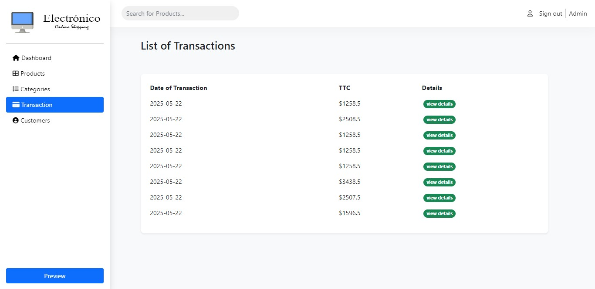

	

# E-commerce Marketplace As Single Page Application
Notre projet consiste à la conception et la mise en œuvre d’un site web dynamique, concerne une application web basée sur une architecture REST. En effet, le but de notre travail est d’offrir une application générale, consiste à réaliser une market place, là où on peut gérer des items, catégories et profils, présenter des articles selon leurs catégories, offrir un système de gestion du panier, système d’authentification et un dashboard d’admin où il peut consulter les statiques de l’application.

**Outils :** Laravel/RestAPI, Angular, Bootstrap, JavaScript, JSON, PHP, MySQL, Sanctum, Github.

## Table des matières

[Partie Conception](#partie-conception)

* [Diagrammes de cas d’utilisation](#diagrammes-de-cas-dutilisation)

* [Diagramme de Classe d’admin](#diagramme-de-classe-dadmin)

* [Diagramme de Classe d’internaute](#diagramme-de-classe-dinternaute)

* [Diagramme de Classe générale](#diagramme-de-classe-g%C3%A9n%C3%A9rale)

* [Mapping Objet/Relationnel](#mapping-objetrelationnel)

[Gestion de l’application](#gestion-de-lapplication)

* [Dashboard de l’admin](#dashboard-de-ladmin)

* [Gestion des items](#gestion-des-items)

* [Gestion des catégories](#gestion-des-cat%C3%A9gories)

* [Gestion des transactions/ventes](#gestion-des-transactionsventes)

* [Gestion des profils](#gestion-des-profils)

* [La barre de recherche](#la-barre-de-recherche)

[Partie client](#partie-client)

* [Vitrine](#vitrine)

* [Détails d’un article](#d%C3%A9tails-dun-article)

* [Panier](#panier)

* [Authentification](#authentification)

[Lien Vidéo](#lien-vid%C3%A9o)

## Partie Conception

### Diagrammes de cas d’utilisation

Les cas d’utilisation permettent d’exprimer les besoins des utilisateurs d’un système. Le diagramme de cas d’utilisation permet donc d’identifier les possibilités d’interaction entre le système et les acteurs.

#### Diagrammes de cas d’utilisation d’administration

Le diagramme suivant présente les cas d’utilisation d’un admin, de sort qu’il peut gérer des items (ajouter, modifier et supprimer un item), gérer des catégories (ajouter, modifier et supprimer une catégorie) et consulter les statistiques de l’application **dashboard** et se déconnecter.

#### Diagramme de cas d’utilisation d’internaute

Le diagramme suivant présente les cas d’utilisation d’un internaute, de sort qu’il peut gérer son panier (ajouter un item au le panier et supprimer un item de panier), effectuer des transactions et se déconnecter.

### Diagramme de Classe d’admin

Ce diagramme permet de donner une représentation statique de tous les rôles accorder au

admin, de même il décrit les interactions entre l’admin et les autres class de l’application.

### Diagramme de Classe d’internaute

Ce diagramme décrit l’aspect dynamique du partie front end, il nous aider à comprendre ce qui peut faire l’utilisateur depuis la consultation des article jusqu’un l’achat.

### Diagramme de Classe générale

Pour bien exprimer le dynamisme de notre application, on a réalisé un diagramme de classe générale, ce diagramme représente l’abstractions des factualités de l’application, ce qui fait on peut mieux comprendre des différentes interactions qui se fait entre les classes. L’internaute peut gérer son panier (ajouter article, supprimer article, vider panier), il peut aussi enregistrer des transactions, c’est-àdire acheter des articles. L’administrateur occupe le rôle d’un gestionnaire, là où il peut ajouter des articles, des catégories, aussi consulter des statistiques concernant : les transactions, les utilisateurs, les articles…

### Mapping Objet/Relationnel

Le Mapping Objet/Relationnel (O/R) consiste à passer d’un diagramme de classe à un Modèle Logique des Données (MLD). Dans ce cas on a transformé notre diagramme de classe générale qui est un Modèle Conceptuel de Donnée à un diagramme O/R qui est un Modèle Logique des Données.

## Gestion de l’application

### Dashboard de l’admin

La figure suivant représente une admin dashboard qui contient des statistiques sur le site nombre des clients, le nombre des ordres, le nombre des produits vendu **sales,** la revenue et les 3 meilleurs produits vendus.

Dans la même page on trouve aussi les 4 meilleurs catégories selon les vendes et les clients récemment inscrit.

### Gestion des items

Pour la gestion des items, l’admin peut ajouter, modifier et supprimer tous les articles. Le bouton **New Article** pour ajouter un article, pour modifier il suffit de cliquer sur le bouton jaune avec crayon et pour la suppression on clique sur le bouton rouge avec déchets.

#### Ajouter un item

Dans la page d’ajoute d’un item l’admin peut remplir le formulaire et cliquer sur le bouton **New Article** comme il peut quitter et retourner dans la liste des articles par cliquer sur le bouton **Article List.**

**Modifier un item** 

Le même que la partie **Ajouter un item.**

### Gestion des catégories

Dans cette figure on a l’affichage de nom des catégories ajoutées et sa date de création.

#### Ajouter une catégorie

Figure qui représente le formulaire d’ajoute d’une catégorie.

#### Modifier une catégorie

Figure qui représente le formulaire de modification d’une catégorie.

### Gestion des transactions/ventes

La figure suivante représente toutes les transactions effectuées avec son montant et sa date d'exécution.

#### Détail d’une transaction

Le bouton **view details** va nous diriger à la page des produits qui concernent la transaction sélectionner et la quantité de chaque produit.

### Gestion des profils

Pour la dernière gestion on a la liste des clients qui en inscrit dans notre application.

### La barre de recherche

La barre de recherche filtre les articles selon la lettre ou le mot donnée.

## Partie client

### Vitrine

Pour la page home de notre application on affiche premièrement les trois derniers articles ajoutés avec un header divise sur trois, une pour afficher les informations de contact, l’autre pour rechercher sur un produit et accéder au panier, et autre pour traverser une catégorie.

Puis on a affiché les articles selon leur catégorie, avec la fixation du navbar en haut

Pour chaque article on affiche, le nom, la quantité disponible dans le stock, et prix unitaire. Puisque on a considéré l’affichage par catégorie, tous ces articles concerne une seule catégorie Laptop. Pour visualiser un article il suffit de cliquer sur l’œil. Lorsque on met le curseur sur catégories on voit tout articles qui existent.

### Détails d’un article

Après qu’on clique sur l’œil ou bien sur l’image de l’article l’application va s’afficher les détails qui concerne cette article

Pour ajouter un article au panier il suffit de cliquer sur le bouton **Add to Cart** en jaune. Dans cette page pour chaque article on affiche la désignation, la quantité disponible. Et le prix de livraison. En bas on affiche les articles de même catégorie pour faciliter aux internautes de trouver ce qu’il cherche.

### Panier

Cette partie est réservé pour afficher le panier du l’internaute. Si personne n’est authentifié, l’application va afficher une fenêtre qui demande à l’utilisateur de s’authentifie.

Alors après l’authentification de l’utilisateur si le panier est vide, une page demande l’utilisateur de commencer l’ajout des articles au panier

L’utilisateur a ajouté un article dans le panier

Sous l’icône du panier dans un badge on affiche le nombre des articles déjà ajoutés au panier.

L’internaute peut diminuer ou augmenter la quantité de l’article dans le panier avant de la confirmation. Une fois que l’utilisateur clique sur **Buy Now** une transaction va s’enregistrer automatiquement.

### Authentification

Si on clique sur le lien **Sign up** une formule d’authentification s’affiche.

Et là, l’application à l’aide du système d’authentification **sanctum** vérifie l’email et password, s’ils sont valides elle va rediriger l’internaute vers la page d’accueil sinon un message d’erreur va s’afficher. On suppose que l’internaute n’a jamais fait l’inscription, on clique sur **I don’t have acount.**

Après le remplissage de tous les champs l’application va rediriger l’internaute vers la page home.

## Lien Vidéo

Lien : [https://drive.google.com/file/d/1XmPjyOwfpkR-Q2GBJ3iSoU6j0WdW6-2Z/view?usp=sharing](https://drive.google.com/file/d/1XmPjyOwfpkR-Q2GBJ3iSoU6j0WdW6-2Z/view?usp=sharing)
